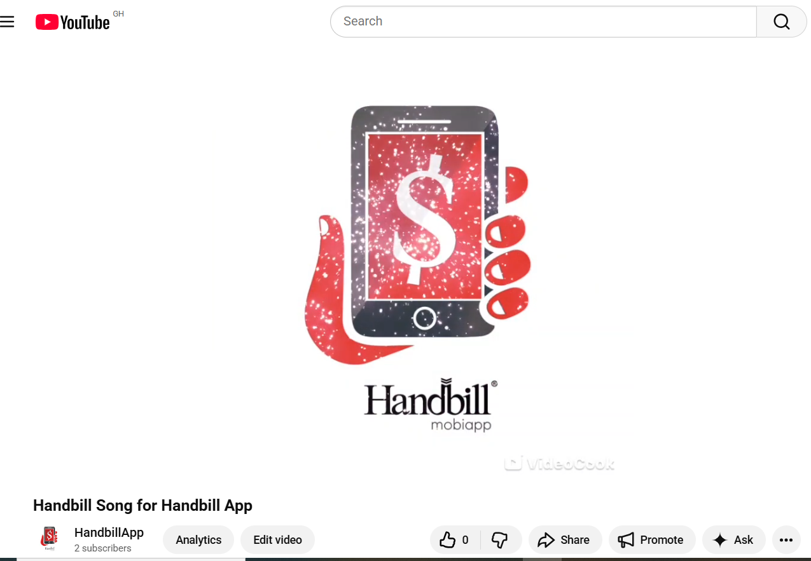
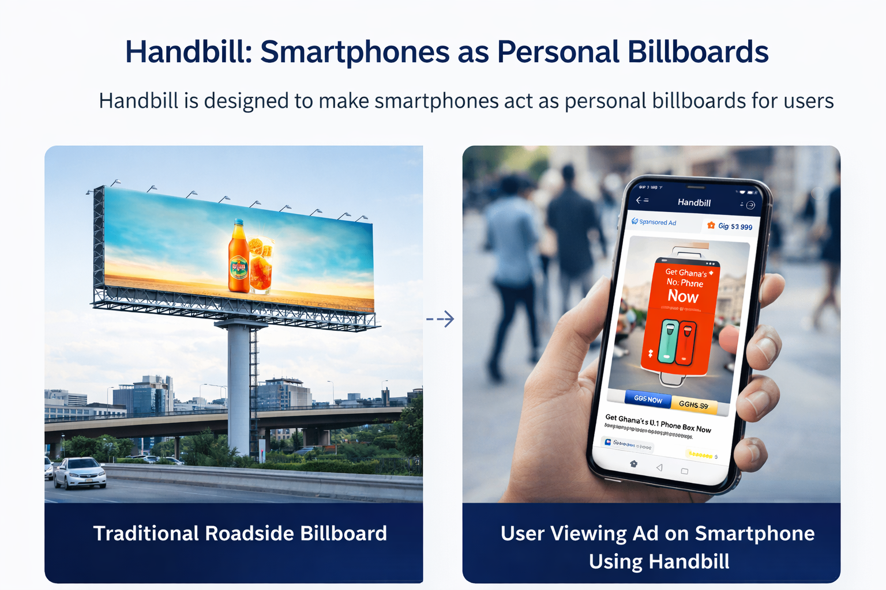
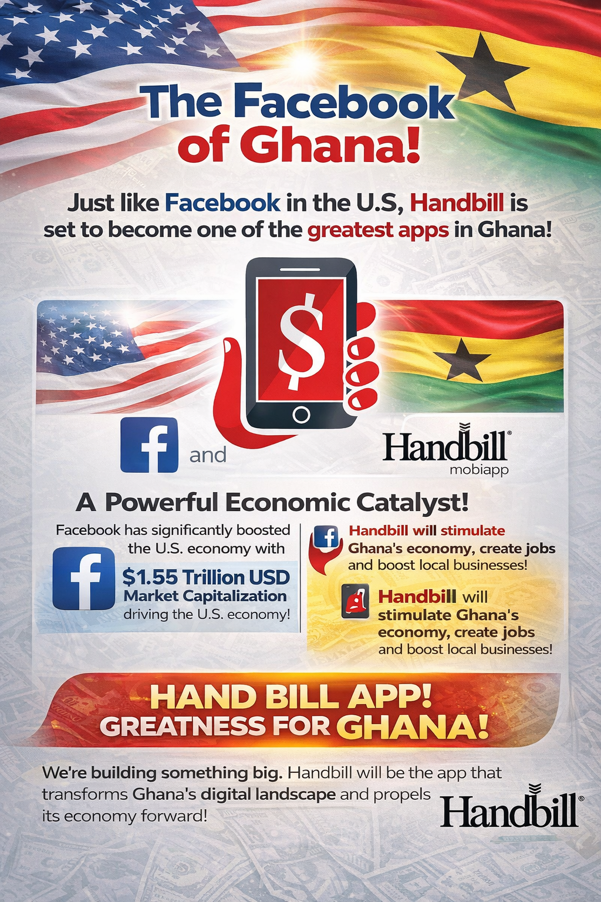

<html>
<head>
  <meta charset="UTF-8">
 
</head>
<body>

  

<h1 style="text-align:center;">Handbill</h1>

  

  <em>Turning smartphones into personal billboards</em>

<h2>About the Project</h2>

  Handbill is an innovative mobile platform currently under active development. Its purpose is to explore new ways to deliver advertisements and connect businesses with people using mobile devices. While the project is still being built, it aims to combine technology, analytics, and user engagement to rethink mobile advertising in a secure and ethical manner.

<h2>Team</h2>

Meet the core team behind Handbill:

<ul>
  <li><strong>Charles Livingstone Ehlah</strong> – Chief Executive Officer (C.E.O.) | Ghanaian  </li>
  <li><strong>Solomon Yaw Adeklo</strong> – Chief Information Officer (C.I.O.)  | Ghanaian  - (https://github.com/solomonyaw) </li>
  <li><strong>Stephen Kumah</strong> – Chief Technology Officer (C.T.O.)  | Ghanaian   </li>
  <li><strong>Emmanuel Ekpe (Elexy)</strong> – Senior Software Engineer / Blockchain Developer/ Cyber Security Expert  | Nigerian   - (https://github.com/Elexy101))</li>  
</ul>

<h2>Project Status</h2>
<ul>
  <li>🚧 Active development</li>
  <li>📱 Mobile and web applications in progress</li>
  <li>🔐 Core features and infrastructure being designed</li>
  <li>🔄 Updates will be shared as development progresses</li>
</ul>

<h2>Concept Illustration</h2>
<h3>Watch our Handbill song on Youtube which creatively captures the vision behind the platform by clicking on the image below<h3>
  

  Handbill is designed to make smartphones act as personal billboards for users. Below is a placeholder illustration showing how mobile devices can display content dynamically:

  
  
<em>Example illustration of a mobile device showing ad content</em>

<h2>Goals</h2>

  The Handbill project aims to:

<ul>
  <li>Explore innovative mobile advertising techniques</li>
  <li>Integrate analytics to measure user engagement and performance</li>
  <li>Provide a foundation for future features that connect businesses and users</li>
  <li>Maintain privacy and ethical standards for all users</li>
</ul>
 

<h2>Stay Updated</h2>

  This repository will be updated regularly with progress reports, development updates, and future features. Contributions are not open at this stage, but we welcome ideas and collaboration inquiries through our contact channels.

  ⚠️ Please note: This project is <strong>not open-source</strong>. The source code is private and will remain confidential on GitHub. Access to the code is restricted to authorized team members only. This repository is intended solely to showcase the project, its progress, and conceptual illustrations.

  <strong>Handbill &copy; 2026 | Under Development</strong>

</body>
</html>
